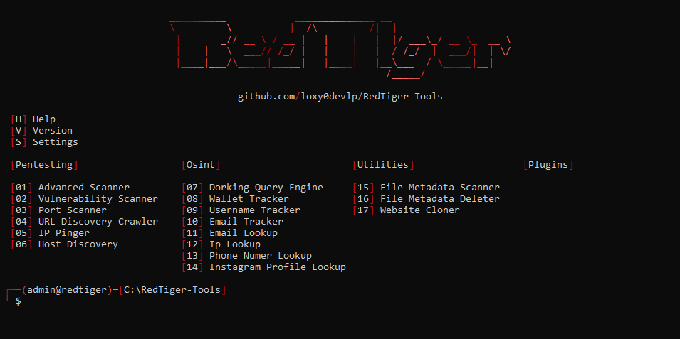

<p align="center">
  
</p>

<h1 align="center">
  
  RedTiger-Tools (v2)
</h1>

<p align="center">
  RedTiger-Tools is a multifunction automation tool dedicated to pentesting and OSINT. The project is open source and designed to be fully configurable according to user needs. It also includes a plugin system that allows users to extend or create new features, in order to centralize multiple tools into a single unified platform.
</p>

<h2>⚠️ Disclaimer:</h2>
<p>
  This version is intended exclusively for educational and lawful use. Any malicious use is strictly prohibited and disclaimed, in accordance with the provisions of the French Penal Code relating to attacks against automated data processing systems (Articles 323-1 to 323-7).
</p>

<h2>📝 Description:</h2>

<ul>
  <li>⚙️ Compatible with Windows and Linux.</li>
  <li>🧠 Legal, advanced and optimized version.</li>
  <li>🔎 Tool oriented toward pentesting and OSINT.</li>
  <li>🧩 Plugin system allowing users to add or create new features in the <a href="Plugins">/Plugins</a> folder. (If you want to create a plugin and publish it on github put the tag "#redtiger-tools" in your repository, the example script can be found in: <a href="Plugins/Example.py">/Plugins/Example.py</a>)</li>
  <li>📁 Centralized configuration via JSON files in the <a href="Data">/Data</a> folder.</li>
  <li>💻 Supports CLI mode and interactive interface.</li>
</ul>

<h2>📸 Preview:</h2>

<p align="center">
  
</p>

<h2>⚙️ Installation:</h2>

<ol>
  <li>Installed the latest version of Python (3.14):</li>
  - Windows:
  <pre><a href="https://www.python.org/downloads">Download Here</a> (The "PATH" option must be enabled during installation)</pre>
  - Linux:
  <pre>sudo apt install python3 -y</pre>

  <li>Installed the latest version of Git:</li>
  - Windows:
  <pre><a href="https://git-scm.com/install/windows">Download Here</a> (The "PATH" option must be enabled during installation)</pre>
  - Linux:
  <pre>sudo apt install git -y</pre>
  
  <li>Clone the repository:</li>
  <pre>git clone https://github.com/loxy0devlp/RedTiger-Tools.git</pre>

  <li>Enter the project folder:</li>
  <pre>cd RedTiger-Tools</pre>

  <li>Launched the setup:</li>
  - Windows:
  <pre>python setup.py</pre>
  - Linux:
  <pre>python3 setup.py</pre>

  <li>Launch the tool:</li>
  - Windows:
  <pre>python redtiger.py</pre>
  - Linux:
  <pre>python3 redtiger.py</pre>
</ol>

<h2>🔄 Update:</h2>

<ol>
  <li>Enter the project folder:</li>
  <pre>cd RedTiger-Tools</pre>

  <li>Update launch:</li>
  <pre>git pull</pre>
</ol>

<h2>🚀 Features:</h2>

```
Tools:
  --help            / -h  : Shows all tools options.
  --version         / -v  : Displays the version and information of the tool.
  --settings-update / -su : Update the tools settings.
  * --mode          / -m  : Mode: decorated / interface
  * --status        / -s  : Status: enable / disable

Pentesting:
  --advanced-scanner      / -as  : Advanced scanning performing all scans. (website, domain, IP, server)
  * --target              / -t   : Service target: <URL> / <domain> / <IP[:port]> / <localhost[:port]>
    --output              / -o   : Creating additional JSON output.
    --http-timeout        / -HT  : Set the maximum HTTP timeout in seconds: <timeout>
    --socket-timeout      / -ST  : Set the maximum socket timeout in seconds: <timeout>
    --http-proxy          / -HP  : Set an HTTP proxy: <proxy:port>
    --socket-proxy        / -SP  : Set a socket proxy: <proxy:port>
    --useragent           / -u   : Set a user-agent: random / <useragent>
    --cookie              / -c   : Set a cookie: <cookie>
  --vulnerability-scanner / -vs  : Scan all vulnerabilities of a website.
  * --target              / -t   : Website target: <URL> / <domain> / <IP:port> / <localhost:port>
    --output              / -o   : Creating additional JSON output.
    --http-timeout        / -HT  : Set the maximum HTTP timeout in seconds: <timeout>
    --http-proxy          / -HP  : Set an HTTP proxy: <proxy:port>
    --useragent           / -u   : Set a user-agent: random / <useragent>
    --cookie              / -c   : Set a cookie: <cookie>
  --port-scanner          / -ps  : Scan the ports of an IP.
  * --target              / -t   : IP target: <IP>
  * --mode                / -m   : Scan mode: single / multiple / range / default / all
    --port                / -p   : Port(s): single: <port> / multiple: <port>,<port> / range: <port>-<port>
    --protocol-scan       / -PS  : Protocol(s): TCP / UDP / TCP,UDP
    --output              / -o   : Creating additional JSON output.
    --socket-timeout      / -ST  : Set the maximum socket timeout in seconds: <timeout>
    --socket-proxy        / -SP  : Set a socket proxy: <proxy:port>
  --url-discovery-crawler / -udc : Scan all urls of a website.
  * --target              / -t   : Website target: <URL> / <domain> / <IP:port> / <localhost:port>
  * --mode                / -m   : Scan mode: onlypage / allwebsite
    --output              / -o   : Creating additional JSON output.
    --http-timeout        / -HT  : Set the maximum HTTP timeout in seconds: <timeout>
    --http-proxy          / -HP  : Set an HTTP proxy: <proxy:port>
    --useragent           / -u   : Set a user-agent: random / <useragent>
    --cookie              / -c   : Set a cookie: <cookie>
  --ip-pinger             / -ip  : Continuously ping an IP.
  * --target              / -t   : IP target: <IP>
  * --mode                / -m   : Ping mode: ICMP / TCP
    --bytes               / -b   : Set the number of bytes for an ICMP ping: <bytes>
    --port                / -p   : Set the port for a TCP ping: <port>
    --interval            / -i   : Set the interval between each ping in seconds: <interval>
    --socket-timeout      / -ST  : Set the maximum socket timeout in seconds: <timeout>
    --socket-proxy        / -SP  : Set a socket proxy: <proxy:port>
  --host-discovery        / -hd  : Determines which hosts are online.
  * --target              / -t   : CIDR target: <IP>/<CIDR prefix>
    --port                / -p   : Set the port for a TCP ping: <port>
    --output              / -o   : Creating additional JSON output.
    --tcp-icmp-timeout    / -TIT : Set the maximum TCP/ICMP timeout in seconds: <timeout>
    --socket-proxy        / -SP  : Set a socket proxy: <proxy:port>

Osint:
  --dorking-query-engine     / -dqe : Query builder for Google, Bing and DuckDuckGo with advanced operators.
  * --engine                 / -e   : Search engine: google / bing / duckduckgo
  --wallet-tracker           / -wt  : Track a crypto wallet's transactions with APIs.
  * --address                / -a   : Wallet target address: <address>
    --output                 / -o   : Creating additional JSON output.
    --http-timeout           / -HT  : Set the maximum HTTP timeout for the API in seconds: <timeout>
    --http-proxy             / -HP  : Set an HTTP proxy for the API: <proxy:port>
    --useragent              / -u   : Set a user-agent for the API: random / <useragent>
  --username-tracker         / -ut  : Track a username across multiple platforms.
  * --target                 / -t   : The target username: <username>
    --output                 / -o   : Creating additional JSON output.
    --http-timeout           / -HT  : Set the maximum HTTP timeout in seconds: <timeout>
    --http-proxy             / -HP  : Set an HTTP proxy: <proxy:port>
    --useragent              / -u   : Set a user-agent: random / <useragent>
  --email-tracker            / -et  : track an email registered on several platforms.
  * --email                  / -e   : Email target: <email>
    --output                 / -o   : Creating additional JSON output.
    --http-timeout           / -HT  : Set the maximum HTTP timeout in seconds: <timeout>
    --http-proxy             / -HP  : Set an HTTP proxy: <proxy:port>
    --useragent              / -u   : Set a user-agent: random / <useragent>
  --email-lookup             / -el  : Retrieve public data from an email.
  * --email                  / -e   : Email target: <email>
    --output                 / -o   : Creating additional JSON output.
    --socket-timeout         / -ST  : Set the maximum socket timeout in seconds: <timeout>
    --socket-proxy           / -SP  : Set a socket proxy: <proxy:port>
  --ip-lookup                / -il  : Fetch public IP data using the "ip-api.com" API.
  * --ip                     / -i   : IP target: <IP>
    --output                 / -o   : Creating additional JSON output.
    --http-timeout           / -HT  : Set the maximum HTTP timeout for the API in seconds: <timeout>
    --http-proxy             / -HP  : Set an HTTP proxy for the API: <proxy:port>
    --useragent              / -u   : Set a user-agent for the API: random / <useragent>
  --phone-number-lookup      / -pnl : Retrieve public data from a phone number.
  * --phone                  / -p   : Phone number target: <number>
    --output                 / -o   : Creating additional JSON output.
  --instagram-profile-lookup / -ipl : Retrieve public data from an instagram username.
  * --target                 / -t   : Username target: <username>
  * --sessionid              / -s   : Your instagram id session: <sessionid>
    --output                 / -o   : Creating additional JSON output.
    --http-proxy             / -HP  : Set an HTTP proxy: <proxy:port>
    --useragent              / -u   : Set a user-agent: random / <useragent>

Utilities:
  --file-metadata-scanner / -fms : Scan all file metadata.
  * --path                / -p   : The file path: <path>
    --output              / -o   : Creating additional JSON output.
  --file-metadata-deleter / -fmd : Remove all file metadata.
  * --path                / -p   : The file path: <path>
  --website-cloner        / -wc  : Clone the entire web page.
  * --target              / -t   : Website target: <URL> / <domain> / <IP:port> / <localhost:port>
    --http-timeout        / -HT  : Set the maximum HTTP timeout in seconds: <timeout>
    --http-proxy          / -HP  : Set an HTTP proxy: <proxy:port>
    --useragent           / -u   : Set a user-agent: random / <useragent>
    --cookie              / -c   : Set a cookie: <cookie>

Notations:
  /  : Or
  [] : Optional
  <> : Value
  *  : Required
```

<h2>👨‍💻 Credits:</h2>

<ul>
  <li>Developed by: <b>Loxy0devlp</b></li>
  <li>GitHub: <a href="https://github.com/loxy0devlp">github.com/loxy0devlp</a></li>
  <li>GunsLol: <a href="https://guns.lol/loxy0dev">guns.lol/loxy0dev</a></li>
  <li>License: <b>MIT License</b></li>
  <li>Version: <b>v1.0 Beta</b></li>
</ul>